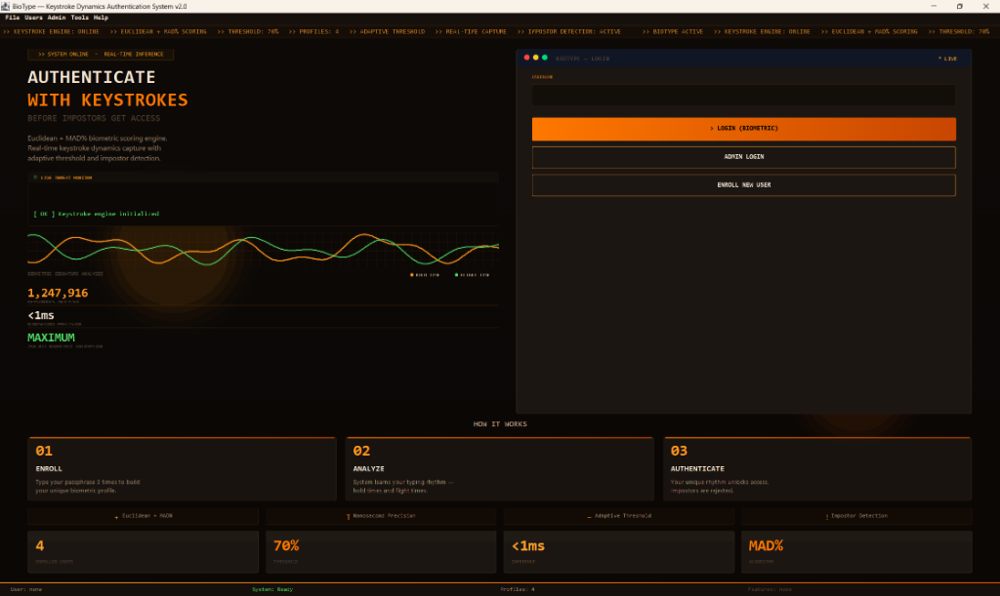
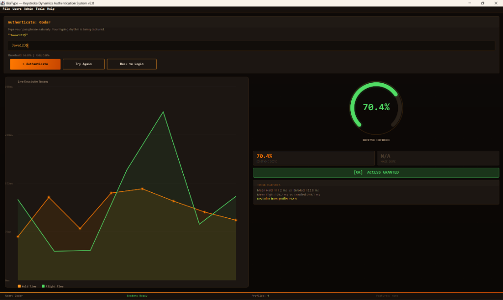
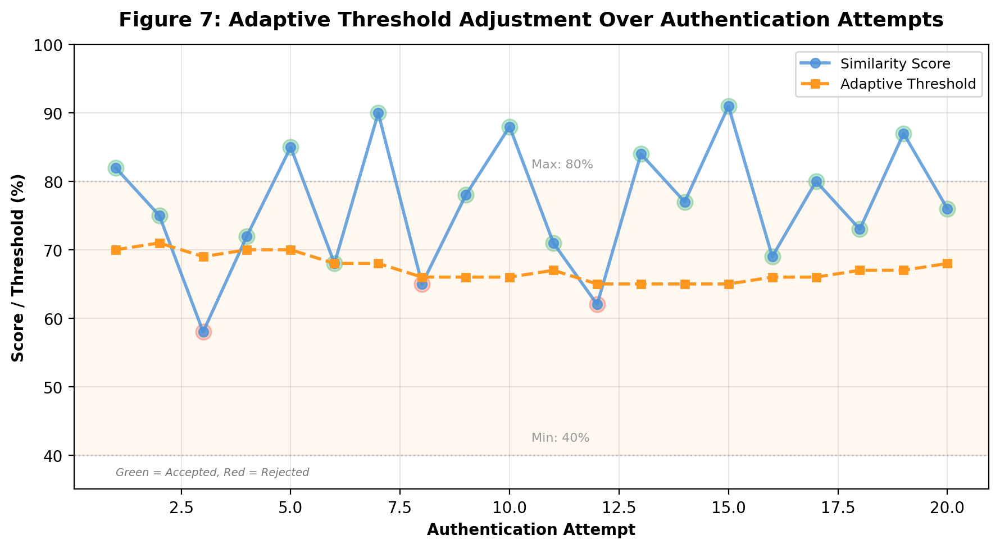

# BioType — Keystroke Dynamics Biometric Authentication System

> **Version 2.0** | Phase 2 Complete | Pure Java, Zero Dependencies

A keystroke biometric authentication system that identifies users by **how they type**, not what they type. Captures key hold duration and inter-key flight time to build unique typing profiles, verified using Euclidean distance + MAD% scoring with an adaptive threshold.

---

## Features

### Core Authentication
- **Keystroke capture** using `System.nanoTime()` for nanosecond-precision timing
- **Euclidean distance + MAD% scoring** converting timing vectors to 0–100% similarity
- **Adaptive threshold** (40–80%) that adjusts based on authentication outcomes
- **Impostor detection** with bot-check, speed anomaly, rhythm analysis, and session lockout
- **Custom passphrase support** — users can set their own phrase during enrollment

### Phase 2 — Advanced Biometrics
- **Two-Factor Authentication (2FA)** — 6-digit OTP via `SecureRandom` with 30-second animated countdown dialog
- **Mouse Dynamics Biometrics** — captures click duration, movement speed, scroll patterns; combined 70% keystroke + 30% mouse scoring
- **ML-Based Adaptive Threshold** — per-user personalized thresholds using moving average of last 10 successful authentications, pattern change detection (fatigue/injury)

### Premium Java Swing GUI
- **Dark theme** with warm orange/amber accent palette
- **Animated login screen** with glassmorphism cards, glow orbs, and floating particles
- **Live keystroke timing graph** during authentication
- **Circular confidence gauge** with smooth animation
- **Admin dashboard** with 5 tabs: Users, Auth Logs, Analytics, ML Threshold, Settings

### Security & Management
- **Role-based access**: Admin (password) vs User (biometric)
- **Input validation** against injection, path traversal, and invalid data
- **Session lockout** after 3 consecutive failed attempts
- **Daily audit logging** with rotation
- **System backup/restore** — ZIP-compressed archives
- **All Phase 2 features togglable** from Admin Settings

---

## Architecture

```
com.keystroke.auth/
├── KeystrokeAuthSystem.java        ← Console entry point
├── User.java (abstract)            ← Base class
│   ├── Admin.java                  ← Password-based admin
│   └── RegularUser.java            ← Biometric-authenticated user
├── KeystrokeCapture.java           ← Timing capture engine
├── KeystrokeProfile.java           ← Profile data model
├── FileManager.java                ← Persistence layer
├── SimilarityScorer.java           ← Strategy interface
│   └── EuclideanSimilarityScorer.java ← Distance algorithm
├── AuthenticationEngine.java       ← Central orchestrator
├── ThresholdManager.java           ← Adaptive threshold
├── ImpostorDetector.java           ← Anomaly detection
├── AuthLogger.java                 ← Audit trail
├── AuthResult.java                 ← Immutable result
├── TwoFactorAuth.java              ← OTP generation & validation [NEW]
├── MouseDynamicsCapture.java       ← Mouse event capture [NEW]
├── MouseDynamicsProfile.java       ← Mouse biometric model [NEW]
├── AdaptiveThresholdML.java        ← Per-user ML threshold [NEW]
├── ConfigManager.java              ← Settings management
├── BackupManager.java              ← Backup/restore
├── ProfileAnalyzer.java / AnalyticsEngine.java
├── InputValidator.java / SystemConstants.java
├── DemoDataGenerator.java / DemoScript.java
├── TestSuite.java / PerformanceTester.java
└── gui/
    ├── Main.java                   ← GUI entry point
    ├── MainWindow.java             ← Application frame & card layout
    ├── LoginPanel.java             ← Animated login screen
    ├── EnrollmentPanel.java        ← Multi-sample keystroke enrollment
    ├── AuthPanel.java              ← Auth with gauge, graph, 2FA
    ├── MouseEnrollmentPanel.java   ← Interactive mouse capture [NEW]
    ├── TwoFactorDialog.java        ← OTP countdown dialog [NEW]
    ├── MLThresholdPanel.java       ← ML admin tab [NEW]
    ├── AdminDashboard.java         ← 5-tab admin panel
    ├── MonitoringPanel.java / SecurityPanel.java
    ├── TimingGraphPanel.java / CircularGaugePanel.java
    └── utils/
        ├── StyleManager.java       ← Theme & color palette
        ├── GUIUtils.java           ← Styled dialogs & tables
        └── ChartBuilder.java       ← Pie/bar chart painter
```

---

## Setup & Installation

### Prerequisites
- **Java JDK 8+** (any edition)
- No external libraries required — pure Java implementation

### Compile

```bash
cd Keystroke-Biometrics
javac -d out src/com/keystroke/auth/*.java src/com/keystroke/auth/gui/utils/*.java src/com/keystroke/auth/gui/*.java
```

### Run (GUI — Recommended)

```bash
java -cp out com.keystroke.auth.gui.Main
```

### Run (Console Mode)

```bash
java -cp out com.keystroke.auth.KeystrokeAuthSystem
```

### Quick Start
1. **Compile** using the command above
2. **Run the GUI** — the premium dark-themed login screen appears
3. Click **Enroll** → enter username → type your passphrase 3 times
4. Click **Authenticate** → type your passphrase → see confidence gauge
5. Login as **admin / admin123** to access the Admin Dashboard

---

## GUI Screenshots

| Login Screen | Authentication | Admin Dashboard |
|:---:|:---:|:---:|
|  |  |  |

---

## Admin Guide

**Login**: Username `admin`, Password `admin123`

### Dashboard Tabs

| Tab | Description |
|-----|-------------|
| **Users** | View, delete, inspect enrolled profiles |
| **Auth Logs** | Browse authentication log entries, export CSV |
| **Analytics** | Pie chart of success/fail, stats |
| **ML Threshold** | Per-user learning progress, confidence intervals, pattern detection |
| **Settings** | Toggle 2FA, Mouse Dynamics, ML Threshold; adjust threshold slider; backup/restore |

### Phase 2 Feature Toggles (Settings Tab)

| Toggle | Effect |
|--------|--------|
| **Two-Factor Authentication** | OTP dialog appears after successful keystroke auth |
| **Mouse Dynamics** | Adds mouse enrollment step + 30% weight in combined score |
| **ML Adaptive Threshold** | Uses per-user personalized thresholds after 5+ logins |

---

## Runtime Data

All runtime data is auto-created on first launch (excluded from git):

```
profiles/
├── users/          ← .profile + .mouse files
├── thresholds/     ← system_threshold.txt
├── logs/           ← auth_YYYY_MM_DD.txt daily logs
├── ml/             ← {username}_learning.dat
├── admin/          ← config.properties
└── backups/        ← keystroke_backup_*.zip
```

---

## Configuration

Settings in `profiles/admin/config.properties`:

| Key | Default | Description |
|-----|---------|-------------|
| `default_threshold` | 60.0 | Authentication threshold (%) |
| `enrollment_samples` | 3 | Typing samples per enrollment |
| `max_failed_attempts` | 3 | Failures before session lock |
| `hold_weight` | 0.6 | Weight for hold timing scoring |
| `flight_weight` | 0.4 | Weight for flight timing scoring |
| `enable_2fa` | false | Two-factor authentication toggle |
| `enable_mouse_dynamics` | false | Mouse biometrics toggle |
| `enable_ml_threshold` | false | ML adaptive threshold toggle |

---

## Testing

### Unit Tests (Console Mode)
Select menu option **6 → 1** in console mode to run 30+ tests covering:
- Keystroke capture, profile building, similarity scoring
- Threshold adjustment, file I/O, impostor detection
- Authentication engine, input validation

### Performance Benchmarks
Select menu option **6 → 2** for auth speed, stress tests, memory profiling.

---

## OOP Design Patterns

| Pattern | Implementation |
|---------|---------------|
| **Inheritance** | `User` → `Admin`, `RegularUser` |
| **Polymorphism** | `login()`, `displayDashboard()` per role |
| **Strategy** | `SimilarityScorer` → `EuclideanSimilarityScorer` |
| **Facade** | `AuthenticationEngine` wraps scorer + threshold + detector + logger |
| **Immutable Object** | `AuthResult` (all fields final) |
| **Observer** | Mouse/Keyboard listener-based capture |
| **Exception Hierarchy** | `AuthenticationException`, `ProfileException` with error codes |

---

## Troubleshooting

| Problem | Solution |
|---------|----------|
| `No profile found` | Enroll the user first |
| `Session locked` | Wait or ask admin to reset |
| `Low confidence scores` | Re-enroll with consistent typing |
| `Compile errors` | Ensure JDK 8+; compile all 3 packages (auth, gui/utils, gui) |
| `profiles/ not created` | Auto-created on first run |

---

*BioType v2.0 — Keystroke Dynamics Biometric Authentication System*
*AIML 2nd Year Project — Pure Java, Zero Dependencies*
